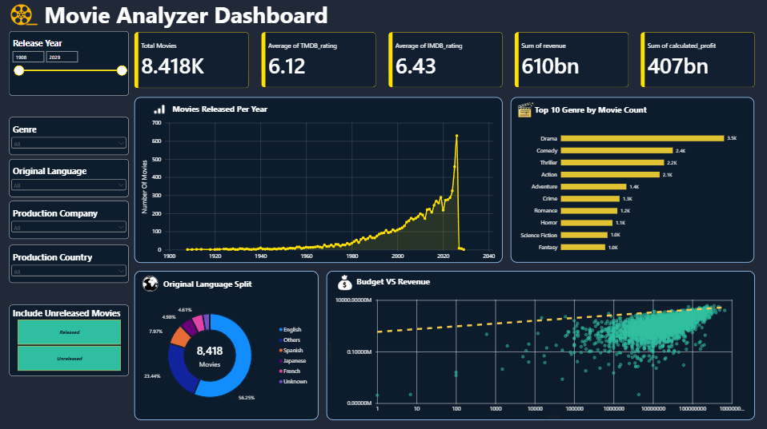

# 🎬 Movie Analyzer Dashboard

An end-to-end movie analytics project using **Python, Pandas, TMDB API, IMDb data, and Power BI** to analyze movie releases, genres, ratings, languages, production companies, financial performance, and other movie characteristics.

---

## 📌 Project Overview

This project combines movie data collected from **The Movie Database (TMDB) API** with **IMDb rating data** to perform data collection, data cleaning, transformation, exploratory data analysis, feature engineering, and interactive business intelligence reporting.

The project was developed in two major stages:

1. **Python-based data collection, preparation, and exploratory analysis**
2. **Power BI data modeling and interactive dashboard development**

The goal of the project is to demonstrate practical skills in **data analysis, data preprocessing, visualization, statistical analysis, data modeling, and dashboard development**.

---

## 🛠️ Tools & Technologies

- **Python**
- **Pandas**
- **NumPy**
- **Matplotlib**
- **Seaborn**
- **Power BI**
- **Power Query**
- **DAX**
- **TMDB API**
- **IMDb Dataset**

---

## 🔄 Project Workflow

```text
TMDB API
   ↓
Data Collection
   ↓
Data Cleaning & Transformation
   ↓
TMDB + IMDb Data Integration
   ↓
Feature Engineering
   ↓
Exploratory Data Analysis
   ↓
Data Modeling
   ↓
Power BI Dashboard
```

---

## 📊 Data Sources

### TMDB

Movie information was collected using the TMDB API, including:

- Movie metadata
- Genres
- Production companies
- Production countries
- Ratings
- Popularity
- Budget
- Revenue
- Release information

### IMDb

IMDb rating and vote-count data was incorporated to complement the TMDB dataset and enable comparison between TMDB and IMDb ratings.

---

## 🧹 Data Preparation

The Python notebook includes:

- Duplicate movie detection and removal
- Genre ID to genre-name mapping
- Transformation of nested/list-based fields
- Production company transformation
- Production country transformation
- Spoken-language extraction
- TMDB and IMDb dataset integration
- Date conversion and release-year extraction
- Missing-value investigation
- Financial data validation
- Financial status classification
- Calculated profit
- Feature engineering for analytical use

---

## 🔍 Exploratory Data Analysis

The analysis covers multiple aspects of the movie dataset.

### 🎬 Movie Trends

- Number of movies released over time
- Movies released by decade
- Release-year trends
- Average movie runtime over time
- Average rating trends

### 🎭 Genre Analysis

- Most frequently occurring genres
- Average ratings by genre
- Genre profitability
- Genre ROI
- Genre production trends over time
- Single-genre vs multi-genre movies
- Average runtime by genre

### 💰 Financial Analysis

- Budget vs revenue relationship
- Budget vs rating relationship
- Most profitable movies
- Biggest financial losses
- ROI analysis
- Average budget, revenue, and profit by genre
- Revenue by release month
- Financial data completeness

### ⭐ Ratings & Popularity

- TMDB vs IMDb rating correlation
- Rating differences between TMDB and IMDb
- Rating vs vote count
- Popularity vs rating
- Identification of highly rated movies with relatively low popularity
- Analysis of highly popular movies with moderate ratings

### 🏢 Production Analysis

- Top production companies by movie count
- Production companies by average rating
- Production companies by total revenue
- Top production countries by movie output
- Production countries by average rating
- Language-based analysis
- Language distribution trends over time

---

# 📈 Power BI Dashboard

The Power BI dashboard provides an interactive overview of the movie dataset.

## Current Dashboard



### Dashboard Features

The current dashboard includes:

- **Total Movies**
- **Average TMDB Rating**
- **Average IMDb Rating**
- **Total Revenue**
- **Total Calculated Profit**
- **Movies Released Per Year**
- **Top 10 Genres by Movie Count**
- **Original Language Distribution**
- **Budget vs Revenue Analysis**
- **Release Year Filter**
- **Genre Filter**
- **Original Language Filter**
- **Production Company Filter**
- **Production Country Filter**

---

## 🧩 Power BI Data Model

The project uses a structured data model prepared from the Python analysis.

### Fact Table

`movies_fact`

Contains the main movie-level information and analytical measures.

### Bridge Tables

- `movie_genre_bridge`
- `movie_company_bridge`
- `movie_country_bridge`

These bridge tables handle relationships where a movie can belong to multiple genres, production companies, or production countries.

---

## 📁 Repository Structure

```text
Movie_Analyzer_Dashboard/
│
├── README.md
│
├── screenshots/
│   └── Movie_Analyzer_Dashboard.png
│
├── notebooks/
│   └── Movie_Analyzer_Dashboard.ipynb
│
└── powerbi/
    └── Movie_Analyzer_Dashboard.pbix
```

---

## 🚀 Future Improvements

Additional Power BI report pages are planned for deeper analysis, including:

- 💰 Financial Analysis
- 🎭 Genre Analysis
- ⭐ Rating Analysis
- 🏢 Production Company Analysis
- 🌎 Production Country Analysis
- 🌐 Language Analysis
- 🎬 Deeper Movie Performance Analysis

---

## 🎯 Project Objective

This project demonstrates practical experience in:

- Data Collection
- Data Cleaning
- Data Preprocessing
- Exploratory Data Analysis
- Data Transformation
- Feature Engineering
- Statistical Analysis
- Data Visualization
- Data Modeling
- Power BI Dashboard Development
- Python and Pandas-based Analytics

The project represents an end-to-end workflow from **raw movie data to interactive business intelligence reporting**.
